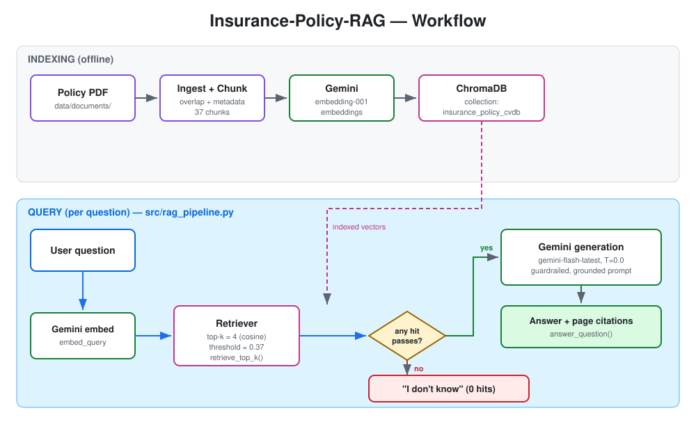

# Insurance-Policy-RAG

[](https://colab.research.google.com/github/arashshams/Insurance-Policy-RAG/blob/new_dev/notebooks/03_insurance_policy_rag.ipynb)
[](https://insurance-policy-rag.streamlit.app/)

**A Retrieval-Augmented Generation (RAG) assistant that answers natural-language questions about a single insurance policy PDF — grounded in the document, cited by page, and honest enough to say "I don't know."**

Ask a question about your coverage; the system retrieves the most relevant passages from the policy, answers *only* from those passages with page citations, and explicitly abstains when the policy doesn't cover the question.



---

## Live demo

Try it now, no installation required: **[insurance-policy-rag.streamlit.app](https://insurance-policy-rag.streamlit.app/)**

Ask questions against the bundled sample policy, or upload your own policy PDF — uploaded files are processed in memory for that session only and are never stored.

## Why this project

Understanding insurance coverage usually means scrolling through a long policy PDF or phoning the insurer. The information is there — it's just hard to locate and interpret. This project reduces that friction with a system that:

- Retrieves the relevant sections of a policy for each question
- Generates a clear, natural-language answer
- Grounds every answer in the source document, with citations
- Refuses to answer anything the policy text does not support

## What it does — and does not — do

**Does:** treats one policy document as the single source of truth, chunks it with overlap and metadata, embeds and stores it in a vector database, retrieves the most relevant passages per question, and generates a guardrailed answer with page citations.

**Does not:** give legal or financial advice, generalize across insurers or policy types, or interpret/extrapolate beyond the policy text.

## Architecture

The diagram above shows the full workflow. In short:

```
PDF -> text extraction -> chunking (overlap + metadata)
-> Gemini embeddings -> ChromaDB vector store
-> similarity retrieval (distance-thresholded)
-> guardrailed answer generation (with citations, or "I don't know")
```

The whole pipeline is consolidated into a single importable module, **`src/rag_pipeline.py`**, so notebooks, evaluation, and future apps all share one code path and one config block.

### Key configuration

| Setting | Value |
|---|---|
| Embedding model | `gemini-embedding-001` (3072-dim) |
| Generation model | `gemini-flash-latest` (temperature 0.0) |
| Vector store | ChromaDB, cosine space, collection `insurance_policy_cvdb` |
| Chunking | `cl100k_base` tokenizer, size 800, overlap 128 |
| Retrieval `k` | 4 (`K_DEFAULT`) |
| Distance threshold | 0.37 (cosine; lower = more similar) |
| Empty-retrieval behavior | short-circuits to "I don't know" |

All values are calibrated (see Evaluation) and env-overridable. The project root defaults to a Drive path but can be pointed anywhere with the `INSURANCE_RAG_ROOT` environment variable, and the whole project is designed to run within the Gemini **free tier**.

### Two runtime modes

- **Dev-persistent** — builds an on-disk Chroma index (plus an optional dev-only `chunks.json`) for local development.
- **App-ephemeral** — embeds an uploaded PDF into an in-memory Chroma collection and persists nothing, so a user's document is never stored.

Both go through the same entry point: `build_index_from_pdf(source, persist_dir=...)`, which accepts either a file path or uploaded bytes.

## Pipeline interface

The module exposes two functions that the notebooks, the evaluation harness, and any future app all call:

- `retrieve_top_k(query, k=K_DEFAULT, threshold=DISTANCE_THRESHOLD)` -> a list of `{id, text, metadata, score}` for the passages that clear the threshold.
- `answer_question(question, k=K_DEFAULT, model_name=GEN_MODEL)` -> `(answer_text, pages, retrieved)`, returning `("I don't know", [], [])` when retrieval comes back empty.

## Repository layout

```
img/
architecture.svg # workflow diagram (shown above)
notebooks/
01_document_ingestion.ipynb # PDF ingest + chunking (source of truth: chunks.json)
02_embeddings_and_indexing.ipynb # builds the persistent Chroma index
03_insurance_policy_rag.ipynb # retrieval + guardrailed answer generation
04_evaluation.ipynb # evaluation harness
eval/eval_questions.json # eval question set (8 in-scope, 4 out-of-scope)
assets/ # documentation images
src/
rag_pipeline.py # the shared, importable pipeline
data/
documents/ # local policy PDF (NOT committed — privacy)
requirements.txt
```

## Getting started

1. Install dependencies: `pip install -r requirements.txt`
2. Provide a Gemini API key (free-tier eligible) via your environment.
3. Place your policy PDF in `data/documents/` (optionally set `INSURANCE_RAG_ROOT`).
4. Run the notebooks in order (01 -> 02 -> 03), or import `src/rag_pipeline.py` directly and call `build_index_from_pdf(...)` then `answer_question(...)`.

### Programmatic use

```python
from src.rag_pipeline import build_index_from_pdf, answer_question

build_index_from_pdf("data/documents/policy.pdf")
answer, pages, retrieved = answer_question("Is physiotherapy covered?")
```

`answer_question` returns the answer text, the cited pages, and the retrieved passages — or `("I don't know", [], [])` when nothing clears the threshold.

### Example questions

- Is physiotherapy covered?
- Are pre-authorizations required?
- What expenses are excluded?

## Sample policy (for calibration)

Calibration and the numbers below were produced against a published, SAMPLE-watermarked medical contract (Manulife FlexCare, 32 pages), which ingestion splits into **37 chunks**. This document is only a stand-in for development; the real policy PDF is never committed. Answers are valid only for users covered by the same policy the index was built from.

## Evaluation (the quality story)

The pipeline is validated end-to-end on the free tier using an evaluation harness (`04_evaluation.ipynb`) over a question set of 8 in-scope and 4 out-of-scope questions. Metrics cover the guardrail (out-of-scope abstention), retrieval quality (in-scope hit rate), and answer quality (in-scope answer-keyword rate).

| Metric | Result |
|---|---|
| Out-of-scope abstention rate | **100%** |
| In-scope retrieval hit rate | **100%** |
| In-scope questions answered | **7 / 8** |

The single non-answer is **correct by design**: that question asks for a figure that lives in a separate Schedule of Benefits, not in this policy document, so the system abstains rather than guess. Evaluation runs are sequential and paced to stay within free-tier limits, and no real policy facts are committed.

## Responsible AI

- Answers are grounded in retrieved document content and cited by page.
- The system returns "I don't know" when the information isn't present.
- Scope and limitations are stated explicitly.
- **Privacy:** the real policy PDF is intentionally not in the repo, and no real policy contents are committed. Note that on the Gemini free tier, content may be used to improve Google's products — acceptable for a sample policy, worth knowing before using real data.

## Roadmap

- **Streamlit MVP** importing `rag_pipeline.py` — a bundled-policy demo plus a user-upload mode (per-session, ephemeral index).
- **FastAPI backend** exposing `POST /ask` over the same pipeline, with the app calling it over HTTP.
- Multi-document support (policy + amendments) and query logging / metrics.

## Contributions

Pull requests are welcome!

For major changes, please open an issue first to discuss what you would like to change or add.

## License

This project is released under the [MIT License](LICENSE).

---

*This project is a technical demonstration of RAG principles and responsible AI design. It is not a source of legal or financial advice.*
